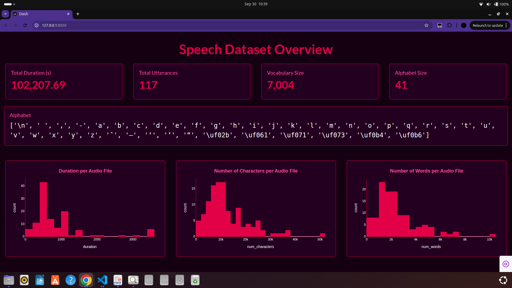

# Advanced NPTEL Data Engineering Pipeline for ASR

This repository contains a fully automated data engineering pipeline built to create high-quality Speech-To-Text (STT) datasets from NPTEL courses. The pipeline handles everything from scraping and downloading to a multi-stage audio cleaning process, culminating in a dataset ready for training robust ASR models.

---

## 📊 Dashboard Overview



**How to Launch the Dashboard:**

```bash
python 06_dashboard/app.py
```

---

## Key Features

- **Fully Automated:** A single command runs the entire pipeline from start to finish.  
- **Robust Scraping:** Uses Playwright to effectively scrape YouTube video and PDF transcript links.  
- **Advanced Audio Cleaning:**
  - Silence Removal: Automatically removes long pauses and silent segments.  
  - Volume Normalization: Ensures consistent audio levels across all files.  
  - Noise Reduction: Reduces background noise to improve signal quality.  
- **Text Normalization:** Extracts and cleans text by lowercasing, removing punctuation, and converting numbers to words.  
- **ASR Manifest Generation:** Creates a `train_manifest.jsonl` file, properly formatted for ASR frameworks.  
- **Visual Dashboard:** Generates the static dashboard image summarizing the dataset.  

---

## 🛠️ Setup Instructions

### 1. Clone the Repository

```bash
git clone hhttps://github.com/Adish7Pandya/Audio_Data_Forge.git
cd Audio_Data_Forge
```

### 2. System Dependencies

- **Python 3.8+**  
- **FFmpeg:**  
  - Windows (Chocolatey): `choco install ffmpeg`  
  - macOS (Homebrew): `brew install ffmpeg`  
  - Ubuntu/Debian: `sudo apt-get update && sudo apt-get install ffmpeg`  

### 3. Install Python Packages

```bash
pip install -r requirements.txt
```

### 4. Install Playwright Browsers

```bash
playwright install
```

---

## ▶️ How to Run the Pipeline

```bash
python main.py --url <YOUR_NPTEL_COURSE_URL>
```

**Example:**

```bash
python main.py  https://nptel.ac.in/courses/106106184
```

---

## Manual Step-by-Step Execution

### **Step 1: Scrape Links**
Scrape all **YouTube audio links** and **transcript PDF links** from a course:

```bash
python 01_scraper/scrape_data.py https://nptel.ac.in/courses/106106184
python 01_scraper/scrape_transcript.py https://nptel.ac.in/courses/106106184
```

### **Step 2: Download Audio and Transcripts**
Download all audio and transcripts from scraped links:

```bash
python 02_downloader/download_data.py
```

### **Step 3: Preprocess and Clean Audio**
Prepare audio files for ASR:

```bash
python 03_audio_preprocessor/cleanse_audio.py
python 03_audio_preprocessor/normalize.py
python 03_audio_preprocessor/remove_trailing_audio.py
python 03_audio_preprocessor/rename_audio.py
```

### **Step 4: Preprocess and Clean Text Transcripts**
Convert transcripts to clean `.txt` files and normalize text:

```bash
python 04_text_preprocessor/preprocess_transcript.py
python 04_text_preprocessor/rename_transcript.py
```

### **Step 5: Create the Training Manifest**
Generate the `train_manifest.jsonl` for ASR training:

```bash
python 05_create_manifest/create_manifest.py
```

### **Step 6: Generate Dashboard Statistics**
Analyze audio and transcript data, and store statistics in a SQLite DB for dashboard visualization:

```bash
python 06_dashboard/process_data.py
```

### **Step 7: Run Everything Sequentially**
Run the full pipeline in one command:

```bash
python main.py https://nptel.ac.in/courses/106106184
```

---


## Observations & Reflections on the Process

### Scraping
- Using Playwright is essential since NPTEL pages are dynamically loaded with JavaScript.

### Audio Processing
- Multi-stage audio cleaning:
  - Removes long silences  
  - Reduces background noise  
  - Normalizes volume  

### Text Normalization
- Converts numbers to words, removes punctuation, lowercases text.

### Automation
- `main.py` orchestrates all steps for reproducibility.

---

## 📂 Data Overview

```
data/
├── links.json               # Scraped YouTube links
├── transcripts.json         # Scraped PDF transcript links
├── audio_downloads/         # Raw audio from YouTube
├── transcript_downloads/    # Raw PDF transcripts
├── audio_wav/               # Audio converted to .wav
├── audio_processed/         # Cleaned audio ready for ASR
├── transcript_processed/    # Cleaned and normalized .txt transcripts
└── train_manifest.jsonl     # Final output ready for ASR training
```

---

## 📁 Project Structure

```
├── main.py                 # Main script to run the entire pipeline
├── 01_scraper/                # Scripts for scraping web data
│   ├── scrape_data.py
│   └── scrape_transcript.py
├── 02_downloader/             # Scripts for downloading audio/text
│   └── download_data.py
├── 03_audio_preprocessor/     # Scripts and tools for audio processing
│   ├── preprocess_audio.sh # Orchestrates audio processing steps
│   ├── clean_audio.py      # For noise reduction and normalization
│   ├── remove_trailing_audio.py
│   └── rename_files.py
├── t04_ext_preprocessor/      # Scripts for cleaning and normalizing text
│   ├── preprocess_transcript.py
│   └── rename_files.py
├── 05_train_manifest/         # Scripts for creating the training manifest
│   └── create_manifest.py
├── 06_dashboard/              # Scripts, database, and assets for the dashboard
│   ├── app.py              # The Streamlit dashboard web application
│   ├── process_data.py
│   ├── dashboard_data.db
│   └── screenshots/
│       ├── dashboard_overview.png
│       └── dashboard_view_1.png
├── data/                   # Directory for all raw and processed data (gitignored)
│   ├── audio_downloads/    # Raw downloaded audio files
│   ├── audio_wav/          # Audio files converted to WAV
│   ├── audio_processed/    # Final, processed audio files
│   ├── transcript_downloads/ # Raw downloaded transcripts
│   ├── transcript_processed/ # Final, processed transcripts
│   ├── transcripts.json
│   └── links.json
├── requirements.txt        # Python dependencies
├── README.md               # This file
└── train_manifest.jsonl    # The final output manifest for training

```
